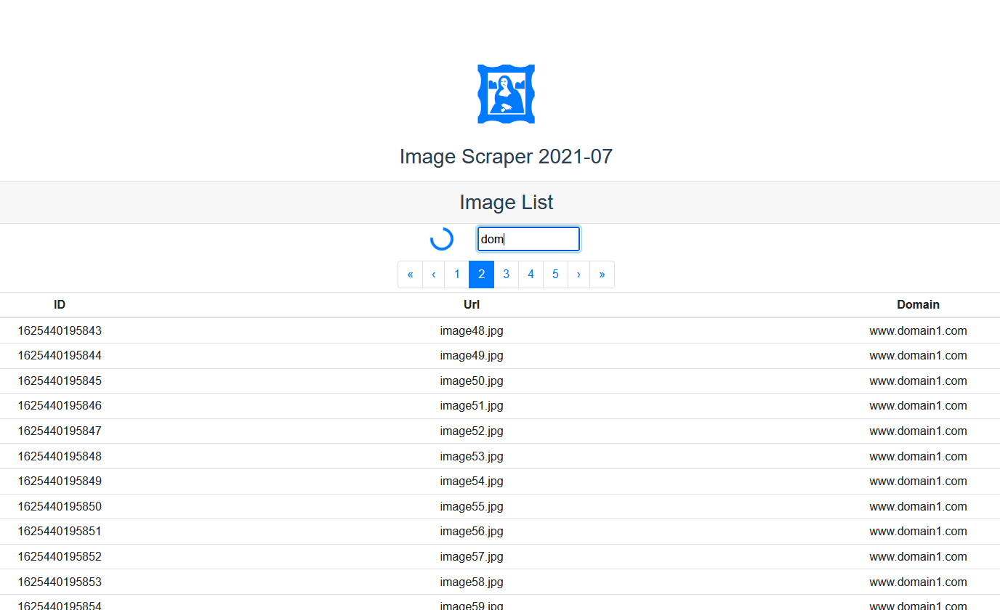
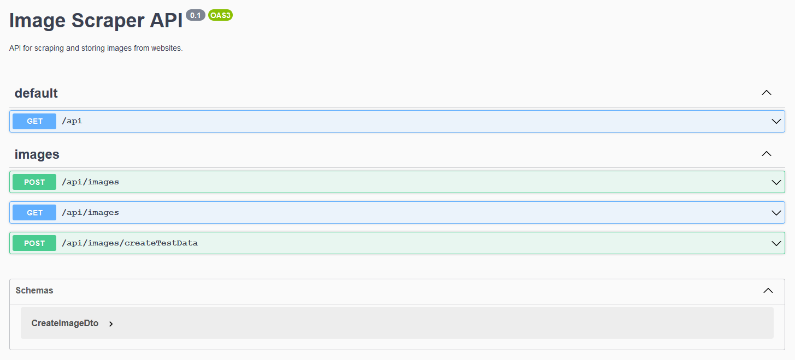

# Image Scraper API


## Instructions
To build and run locally:
```bash
git clone https://github.com/JoseHdez2/image-scraper-2021-07.git
cd image-scraper-2021-07

# install and build static Vue client
cd client
npm i
npm run build

# install, build and start NestJS api
cd ..
npm i
npm start
```
Finally, open a browser in `localhost:3000` to see the frontend, and navigate to `localhost:3000/api` to see the API documentation.
Create test data with the provided endpoint, and navigate back to the client to paginate and filter it.

The implemented points are:
- An API that stores and accepts images with a domain and url, and filters by domain.
- A frontend that displays this data with pagination and filtering.

## Screenshots
### Client:

### Api:

